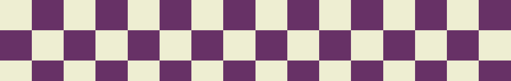
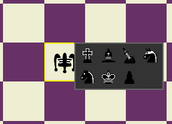
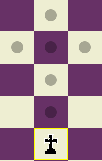
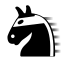
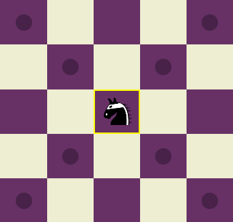
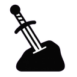
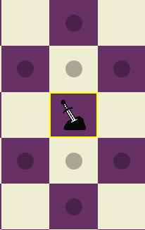

# Xadrez 2 – Instruções de Execução

## Java (NetBeans / IntelliJ)
**Pré-requisito:** Java JDK 17+ e Maven.

**NetBeans:**  
- Clique com o botão direito no projeto → **Set as Main Project**  
- Garanta que a **Main Class** é `org.example.vamo_ver.HelloApplication`  
- Se o projeto tiver **Maven Wrapper** (`mvnw`), o NetBeans usa ele automaticamente  
- Se não tiver, configure o Maven global:  
  `Tools → Options → Java → Maven → Maven Home`  
- Clique em **Run** (não use **Execute Maven → exec:j**

(Enfrentamos problemas em rodar utilizando o NetBeans, recomendamos fortemente para rodar a aplicação em java, utilizar o IntelliJ que enfrenta menos problemas com relação ao Maven e o Maven Wrapper)

**IntelliJ:**  
- `File → Open` → selecione a pasta  
- Clique na classe `HelloApplication` → **Run**

**Web:**
- Abra index.html presente na pasta ProjetoJS na raiz do repositório no navegador (Chrome, Edge ou Firefox)

# ♟️ Xadrez 2

Xadrez foi um jogo criado no final do século XV, tendo evoluído de um jogo mais antigo de origem indiana chamado **Chaturanga**.  
Chaturanga teria se espalhado pelo mundo árabe e posteriormente chegado à Europa, sofrendo modificações até chegar no modelo de jogo que temos hoje.  

Apesar disso, as regras, mecânicas e peças do jogo se mantiveram praticamente intocadas por séculos, não sendo percebidas modificações ou inovações que se destacassem a ponto de exigir uma mudança definitiva no jogo.

Indicamos fortemente a leitura do README diretamente pelo GitHub (Link logo abaixo) visto que a formatação e as imagens que auxiliarão no entedimento geral do Relatório se encontram lá.

---

## 🔗 Repositório do GitHub

https://github.com/arthurviny/JogoXadrez

## Integrantes da Equipe 
- Arthur Vinícius Costa Barreto
- Bruno Lopes dos Santos

## ♟️ Tentativas de Inovação

Algumas tentativas de mudança chegaram a acontecer. Entre elas, uma das mais populares foi o **Chess960**, variação do xadrez tradicional inventada por *Bobby Fischer*, renomado enxadrista.  

Cansado da monotonia do início das partidas de xadrez, Fischer pensou que seria mais interessante se as peças da primeira fileira do tabuleiro fossem embaralhadas, possibilitando uma maior gama de variações de jogos e exigindo atenção total, e não apenas a memorização de aberturas convencionais.

---

## ♟️ Mas... e se fosse além?

E se, além de embaralhar as peças, Fischer tivesse **inventado novas peças** e aleatorizado também quais peças iriam ao tabuleiro?  

Foi com essa mentalidade que criamos o **Xadrez 2**, o possível sucessor do xadrez, possuindo **4 novas peças**, descritas a seguir:

---

## 🎭 Bobo da Corte

| Peça | Movimentação |
|------|-------------|
|  |  |

Na corte do reino, o Bobo da Corte é um mestre do caos e da imprevisibilidade.  
Ele brinca com a lógica e a ordem, rindo da honra da nobreza e trazendo uma pitada de loucura à seriedade do jogo.

**Movimentação:**  
- Pode imitar a movimentação de qualquer peça do tabuleiro.  
- Só pode voltar a imitar uma determinada peça **depois de ter imitado todas as outras** presentes no tabuleiro.  
  - Exemplo: se ele imitar a Rainha, só poderá voltar a imitá-la depois de ter imitado Torre, Cavalo, Bispo e Rei.

**Detalhe importante:**  
No jogo, suas opções são mostradas ao selecionar o Bobo e clicar com o botão direito, abrindo uma **GUI de seleção** de peças possíveis para imitar.  
Caso o Rei esteja em **check**, a GUI mostrará somente as peças que possam impedir o check, facilitando a experiência do usuário.

---

## ✝️ Templário

| Peça | Movimentação |
|------|-------------|
|  |  |

Poderosa ordem militar católica da Idade Média, criada para proteger os peregrinos cristãos na Terra Santa durante as Cruzadas.  
Extremamente influentes e icônicos na época, agora também presentes no tabuleiro.

**Movimentação:**  
- Move-se em **cruz**, mas somente **para frente e para trás**.

---

## 🕵️ Ladrão

| Peça | Movimentação |
|------|-------------|
|  |  |

O Ladrão é uma figura astuta que vive nas sombras do reino.  
Sem honra ou nobreza, despreza a batalha direta, mas, quando consegue o que quer, foge rapidamente para garantir sua sobrevivência.

**Movimentação:**  
- Similar ao Bispo, mas com alcance de **apenas 2 casas**.  
- Diferencial: ao capturar uma peça, pode **permanecer na casa** ou **recuar antes da vez do adversário**.

---

## 🛡️ Herói

| Peça | Movimentação |
|------|-------------|
|  |  |

O Herói é um cavaleiro honrado que vive para proteger o seu reino e o seu Rei.  
Sua força reside em sua lealdade, e ele luta com uma fúria incontrolável quando seu rei se encontra em perigo.

**Movimentação:**  
- Move-se em **formato de seta**, para frente e para trás.  
- Quando o Rei entra em **check**, seu alcance aumenta em **+1**, permitindo proteger melhor o soberano.

---

## 💻 Xadrez e a Programação Orientada a Objetos

Este projeto foi desenvolvido aplicando conceitos de **POO (Programação Orientada a Objetos)** para estruturar as peças, regras e mecânicas do Xadrez 2, explorando herança, polimorfismo e encapsulamento, os três pilares da Progração Orientada a Objetos de forma prática para a matéria de Programação Orientada a Objetos com o professor Leonardo.

Primeiramente, nota-se de maneira explícita, a presença da herança ao passo que, todas as classes de peças, herdam de uma classe mãe denominada de "Peça", classe essa que é abstrata, conceito também abordado durante as aulas, optando pela escolha de uma classe abstrata no lugar de uma interface pela praticidade de ter partes que serviriam para todas as peças, como o getNomePeca e o getCor.

Partindo para o polimorfismo, durante o desenvolvimento do projeto, foram utilizados a maioria dos tipos de polimorfismo, sendo cruciais para o desenvolvimento da aplicação, abaixo estão esses tipos
e onde e como foram utilizados no nosso código:

- Polimorfismo de Sobrecarga: Como já dito anteriormente, todas as classes de peças foram criadas a partir da classe mãe, herdando todos os seus comportamentos e métodos, a partir disso, foi utilizado
o polimorfismo de sobrecarga para sobescrever os métodos utilizados na classe mãe, métodos que deveriam estar presentes em todos os tipos de peça, o método mais essencial e mais utilizado durante o
desenvolvimento "isMovimentoValido" foi sobescrito por cada peça para indicar que movimento seria válido ou não para cada peça.
- Polimorfismo de Coerção: O polimorfismo de coerção basicamente trata de uma conversão ímplica ou explícita de tipos, no nosso código, isso foi necessário na criação da peça do BoboDaCorte, a medida
que, para definir um modo no bobo da corte, precisamos pegar a peça selecionada, e essa pecaSelecionada, por ser apenas do tipo Peca, não tinha acesso aos métodos específicos do BoboDaCorte para então definir o seu modo, então o que foi feito, através do polimorfismo de coerção, convertemos explicitamente a peca para o tipo Bobo, através da linha BoboDaCorte bobo = (BoboDaCorte) pecaSelecionada, indicando ao compilador que aquela peça em específico é do tipo BoboDaCorte.
- Polimorfismo de Inclusão: Temos então o polimorfismo de inclusão, que diz sobre tratar objetos de diferentes subclasses como se fossem objetos da superclasse, isso é evidenciado em alguns momentos
no código, mas um ponto bastante evidente é na parte de criação de peças, especialmente no construtor do Tabuleiro, que trata onde as peças inicialmente estarão, fazemos com que cada peca do tipo
Peca, receba um tipo de Peça através da função criarPeca, que retorna através de um switch um tipo diferente de construtor de peca.
- Polimorfismo Paramêtrico: Quanto ao polimorfismo paramêtrico, seu uso se deu exclusivamente pelo uso da biblioteca Collections, que em sua composição, por de trás dos panos, utiliza o polimorfismo
paramêtrico, através do Generics da linguagem Java. Durante o processo de desenvolvimento, foram necessárias a criação de listas de tamanhos indeterminados, que iriam variar dependendo de determinados comportamentos dentro do jogo, tendo isso em vista, fizemos uso de um ArrayList, que cumpriu seu papel nesse quesito. Também foi utilizado um HashSet (Conjunto), que como sabemos, funciona assim como
um conjunto matemático, não permitindo duplicatas, o que também se mostrou útil durante a realização do projeto.

E por último, quanto ao quesito de encapsulamento, outro importante pilar, como se sabe, o encapsulamento trata do príncipio de proteger os dados internos de uma classe, permitindo acessa-los ou modifica-los através de métodos especiais (os chamados Getters e Setters), garantindo então dessa forma segurança e organização de código. Isso se demonstra presente em vários momentos ao longo do
código de modo que seria muito difícil nomear a dedos tais casos, mas um bom exemplo seria através do método de setarModoDoBobo, em que o funcionamento que ocorria era: através do nosso controller que coordenava o que acontecia na GUI, nós chamavamos a classe do tabuleiro, que dizia a respeito do tabuleiro do jogo em questão, e então, chamava um setarModoBobo para esse tabuleiro em questão, e dentro dessa tabuleiro em questão, outro set era chamado, para mudar então o modo do bobo do tabuleiro em questão e da cor em questão, mostrando assim um uso controlado dos estados da aplicação e respeitando o princípio do encapsulamento. Importante ressaltar que essa abordagem foi utilizada em inúmeras outras partes da aplicação, não só Setters como também Getters, como adquirir a cor do jogador em questão para modular suas jogadas. 

Assim, percebemos como a Programação Orientada a Objetos foi crucial para o desenvolvimento do projeto, sendo uma abordagem que tornou o jogo mais escalável, a medida que a criação de novas peças agora já é muito mais facilitada com a abordagem com herança, como se tornou um código menos propenso a erros por conta da organização e proteção do princípio do encapsulamento, além do polimorfismo facilitar diversos processos combinacionais e lógicos dentro do jogo, onde sem isso, sua criação seria muito mais truncada e complexa. 

## 💻 Principais funções para funcionamento do Xadrez

Durante o desenvolvimento, foi necessário a criação de inúmeras funções pra simular o comportamento de como um jogo de xadrez ocorre na realidade mas dessa vez em um ambiente computacional. Inicialmente é válido salientar que por toda a abordagem ter sido feita utilizando **JavaFX**, temos em nossa estrutura um arquivo de `Application`, responsável por carregar todos os nossos arquivos **FXML** e como eles interagem entre si, como também foi necessário a criação de um `Controller`, que funcionava como ponte entre entre o que acontecia no nosso *View* (fxml) e a própria lógica de jogo da nossa classe de `Tabuleiro` que detinha o jogo em si.

Como dito, nosso `Controller` funciona como uma espécie de ponte entre o que acontece na nossa *View* e o jogo de xadrez de fato, assim, nele estão contidos "**Listeners**", ou em tradução livre "Escutadores" para cada célula do tabuleiro, dessa maneira, temos controle de cada click que acontece no tabuleiro e o que está sendo clicado, sem necessidade de comentar a importância disso especialmente quanto a movimentação das peças no tabuleiro. Dessa forma, abaixo estão documentadas o funcionamento das principais funções do nosso controlador e como elas interagem com a lógica de jogo em si:

- `initialize()`: Como o próprio nome já diz, essa função está responsável por inicializar algumas das principais variáveis e funções do jogo, como as peças que cada *Bobo da Corte* tem acesso, como também chamar a função que desenha o tabuleiro em si para que as peças estejam visíveis, puxando nossa instância do tabuleiro com o array 8x8 de peças e então colocando na interface gráfica.

- `handlePrimaryClick()`: Nessa função, o que fazemos é, pegamos a célula clicada, que vem como argumento da nossa função, verificamos se não há nenhuma **pecaSelecionada**, se não houver, pegamos essa peça que clicamos e se ela for da cor do **turno atual**, selecionamos efetivamente ela, e chamamos a função de `mostrarMovimentosValidos` dessa peça, que nos diz como essa peça pode se mover dentro do tabuleiro. Partimos então para o caso em que já há uma peça selecionada, nesse caso, o que vamos fazer é mexer essa peça pra algum dos quadrados válidos dela e utilizando a função de `moverPeca` que efetivamente move a peça no nosso Array 8x8 de peças, que posteriormente será redesenhado na GUI antes de trocar de turno. Nessa função também é feita a lógica de peças como o *Peão*, *Bobo da Corte* e *Ladrão*, verificando se o peão irá para um casa de promoção, removendo o modo usado pelo bobo da corte, e verificando se houve uma captura feita pelo ladrão antes de trocar de turno.

- `handleSecondaryClick()`: Função bastante simples, basicamente trata do caso em que, se a peça selecionada for uma instância de *Bobo da Corte*, isto é, for um Bobo de fato, o que fazemos é, por essa peça ter um Listener para o botão direito, chamamos a função de `modularBobo` que cuida de fato da troca de modos do bobo.

- `isMovimentoLegal()`: Função que válida se um movimento é legal ou não de ser feito, essa função foi feita com o objetivo de verificar se o movimento que o jogador está fazendo não coloca o próprio **Rei** em **check**, primeiro verificamos se a jogada é válida *geometricamente*, se a peça pode fazer isso, se não poder, o movimento não é legal, então, caso passe dessa parte, o que será feito é, um clone do tabuleiro atual é criado, e verifica-se se, se após fazer esse movimento, o rei fica em check, caso fique, o movimento não é legal, caso não fique, o movimento é legal e o jogador pode então fazer sua jogada.

- `temMovimentoLegal()`: Função que tem como objetivo verificar se o jogador ainda tem algum movimento legal, o que é feito é, pega-se cada peça do tabuleiro da cor em questão, e verifica-se se há alguma jogada válida pra cada uma dessas peças, de certo modo verificando se alguma jogada poderia salvar o **Rei** em caso dele estar em check, caso não haja nenhum movimento legal há se fazer, a função retorna `false`, e será crucial para a função de `verificarFimDeJogo()`. Um adendo importante é que essa função também percorre todos os possíveis modos do bobo, pra ver se algum dos modos tem alguma jogada legal.

- `verificarFimDeJogo()`: Chamada a cada troca de turno, verifica se o turno atual tem algum movimento legal, se não houver, o jogo acabou, contendo dois possíveis jeitos de acabar o jogo, com ele empatando por afogamento ou por **checkmate**, isso é feito verificando se no momento que não há nenhum movimento legal, o rei está em check ou não.

- `modularBobo()` / `modularPromocao()`: Funções responsáveis por criar um mini popup para que o usuário possa escolher seu respectivo modo do bobo, como também em que peça o peão quer ser promovido.

- `mostrarMovimentosValidos()`: Função que percorre todo o array do tabuleiro, criando um pequeno circulo transparente nas posições em que o movimento é legal, isso é feito passando a posição da peça que se quer verificar se há posições legais para cada posição do tabuleiro, se houver, ele irá criar o circulo transparente usando javafx naquela posição. Detalhe importante: também a função de `limparMovimentosValidos()`, que foi feita para contornar um problema que estava ocorrendo com o bobo em que os movimentos válidos estavam sendo sobrepostos.

Agora, uma vez comentadas as funções principais do nosso controller que gerencia entre a interface gráfica e o nosso jogo de fato, é importante também entender as principais funções do nosso jogo de fato, ou seja, as funções da nossa classe tabuleiro, onde toda a lógica de jogo e o tabuleiro em si está localizado. Abaixo estão listadas as principais e o que fazem:

- `check()`: Testa todas as peças do tabuleiro verificando se algum movimento válido dessas peças está no mesmo quadrado do **Rei** (ou das coordenadas passadas como parâmetro), caso esteja, retorna `true`, informando que a peça em questão (no nosso caso apenas o Rei) está em check. Importante que nessa função, ele também checa todos os modos do bobo, isso foi feito para que o rei não possa se locomover para posições em que algum dos modos do bobo pode resultar em sua captura.

- `clonar()`: Função que cria um novo tabuleiro **clone** do atual, foi necessário para a função de `isMovimentoLegal()` do nosso controller, pois um novo tabuleiro é criado pra simular se após uma jogada for feita, o Rei teria entrado em check por conta disso.

- `criarPeca()`: Função que recebe como parâmetros uma string indicando que peça deve ser criada, e a cor da peça que deve ser criada, utilizando isso em um switch case em que o retorno é um objeto de tal respectivo tipo que irá ser alocado a um tipo `Peca` e posteriormente colocado no tabuleiro.

- `moverPeca()`: Função que recebe como parâmetros, a linha inicial e a coluna inicial de uma dada peça, assim como para onde ela irá a seguir, isso após ter sido feita a validação individual presente em cada tipo diferente de peça (`isMovimentoValido`), assim então limpando a posição inicial e chamando `setPeca()` para colocar a peça na sua nova localização.

- `encontrarRei()`: Função com o único objetivo de achar onde o rei está no tabuleiro, foi necessário sua criação para verificar onde o rei está a todo momento para verificar se ele não está em check.

- `encontrarHeroi()`: Função com o único objetivo de achar onde está o herói no tabuleiro, se houver um, pois caso o Rei entre em check, o herói precisa entrar em modo de fúria, e era necessário saber sua posição para isso.

- `setModoBobo()`/`setFuriaHeroi()`: Função feita com objetivo de trocar o estado das peças em questão através da classe do Tabuleiro, garantindo o princípio do encapsulamento e evitando modificações diretas que poderiam ser problemáticas.

- `getPecasNoTabuleiro()`: Função *getter* que retorna todas as peças que estão no tabuleiro, importante para a criação do array de modos do bobo.

  # Conclusão 

  O desenvolvimento do Xadrez 2 foi uma jornada de aprendizado imensamente engrandecedora. Mais do que apenas um projeto técnico, foi a oportunidade de transformar conceitos teóricos da Programação Orientada a Objetos em uma aplicação interativa e funcional. A complexidade de modelar um sistema como o xadrez, com suas inúmeras regras e interações, solidificou de forma prática nosso entendimento sobre herança, polimorfismo e encapsulamento.

Gostaríamos de estender um agradecimento especial ao nosso professor, Leonardo Nogueira, cuja orientação e desafios propostos foram fundamentais para nos guiar através deste processo. Este projeto não apenas aprimorou nossas habilidades em Java e JavaScript, mas também nos ensinou a pensar de forma mais estruturada
